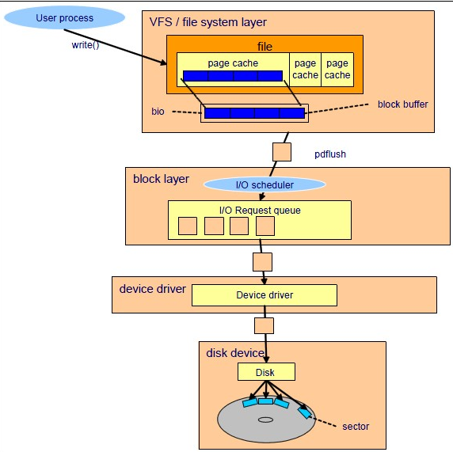

#  IO子系统架构




# 指标

## vm:虚拟内存

**vm.dirty_background_ratio:**这个参数指定了当文件系统缓存脏页数量达到系统内存百分之多少时（如5%）就会触发pdflush/flush/kdmflush等后台回写进程运行，将一定缓存的脏页异步地刷入磁盘；

**vm.dirty_ratio:**而这个参数则指定了当文件系统缓存脏页数量达到系统内存百分之多少时（如10%），系统不得不开始处理缓存脏页（因为此时脏页数量已经比较多，为了避免数据丢失需要将一定脏页刷入磁盘）；在此过程中很多应用进程可能会因为系统转而处理文件IO而阻塞。

**pdflush的作用：**负责将page cache中的脏页数据取出来，写入磁盘中

**使用场景：**当数据的关键性不是很高的时候，可以将上面2个值调大；当数据关键性很高的时候，上面2个参数的值要调低，保证数据丢失的最小；


之前一直错误的一位dirty_ratio的触发条件不可能达到，因为每次肯定会先达到vm.dirty_background_ratio的条件，后来才知道自己理解错了。确实是先达到vm.dirty_background_ratio的条件然后触发pdflush进程进行异步的回写操作，但是这一过程中应用进程仍然可以进行写操作，如果多个应用进程写入的量大于pdflush进程刷出的量那自然会达到vm.dirty_ratio这个参数所设定的坎，此时操作系统会转入同步地处理脏页的过程，阻塞应用进程。


## PDFLUSH机制

- 定时方式：

定时机制**定时唤醒pdflush内核线程，周期为/proc/sys/vm/dirty_writeback_centisecs** ，单位是(1/100)秒，默认值500(5秒)。每次周期性唤醒的pdflush线程并不是回写所有的脏页，而是只**回写变脏时间超过****/proc/sys/vm/dirty_expire_centisecs**（单位也是1/100秒），默认值3000(30秒)。

**注意：变脏的时间是以文件的inode节点变脏的时间为基准的**，也就是说如果某个inode节点是10秒前变脏的，pdflush就认为这个inode对应的所有脏页的变脏时间都是10秒前，即使可能部分页面真正变脏的时间不到10秒，细节可以查看内核函数wb_kupdate()。

- 内存不足的时候：

这时并不将所有的dirty页写到磁盘，而是每次写大概1024个页面，直到空闲页面满足需求为止。

- 写操作时发现脏页超过一定比例：

1. 当**脏页占系统内存的比例**超过**/proc/sys/vm/dirty_background_ratio** 的时候，write系统调用会唤醒pdflush回写dirty page,直到脏页比例低于/proc/sys/vm/dirty_background_ratio，但write系统调用**不会被阻塞，立即返回**。
2. 当**脏页占系统内存的比例**超过**/proc/sys/vm/dirty_ratio**的时候， write系统调用会被被**阻塞**，主动回写dirty page，直到脏页比例低于/proc/sys/vm/dirty_ratio，这一点在2.4内核中是没有的。

- 用户调用sync系统调用：

这是系统会唤醒pdflush直到所有的脏页都已经写到磁盘为止。

### 避免拥塞-使用多个线程

pdflush线程是动态变化的，每个线程尽可能的从每个超级块的脏页面链表中回收数据，pdflush避免了因为一个磁盘忙而导致其余磁盘饥饿的情况，在常规情况下这种策略效果不错。

假如每个pdflush线程在同一个拥塞队列上挂起了怎么办？

这时pdflush采用拥塞回避策略，主动尝试从那些没有拥塞的队列回写，从而防止欺负某一个忙碌的设备。flusher线程则是和具体块设备相关联，每个给定的线程从每个给定设备的脏页面链表回收数据，并回写到对应的磁盘，由于每个磁盘对应一个线程，所以不需要复杂的拥塞避免策略，降低了磁盘饥饿的风险。

# 缓存

## 产生背景

访问磁盘的速度远远低于访问内存的速度。

数据一旦被访问就很有可能在短期内被再次访问（临时局部性原理）。

## 目的

页高速缓存(cache)是linux内核实现磁盘缓存，主要用来减少对磁盘的IO操作，通过把磁盘的数据缓存在物理内存中，把对磁盘的访问变为对物理内存的访问。

## 概要

 页高速缓存是由内存中的物理页面构成，其内容对应磁盘上的物理块。

高速缓存大小可以动态调整，可以通过占用空闲内存进行扩张，也可以自我收缩以减轻内存的使用压力。

页高速缓存中的页可能包含多个不连续的物理磁盘块，也正是由于页面中映射的磁盘块不一定连续，所以在页高速缓存中检测特定数据是否已被缓存并不容易。

linux页高速缓存的目标是缓存任何基于页的对象，包括各种类型的文件和各种内存映射。

### 读缓存

流程：

```
文件IO读操作(用户空间)
  内核空间进行IO读操作
​     do

​          if 读取对象在页高速缓存中：
​             then:直接访问内存；
​          else:
​              内核进行IO调度：
​                   1.从磁盘读取数据
​                    2.将数据放入高速缓存中（系统并不一定是缓存整个文件，有可能是缓存部分内容）

​    done
```

### 写缓存

三种策略：

1 不缓存（nowrite）。高速缓存不去缓存任何写操作，直接跳过缓存写入磁盘，同时也使缓存的数据失效。
 2 写通透：写操作自动更新内存缓存，同时也更新磁盘文件。因为写操作会立刻穿透缓存到磁盘中，这对于保存缓存一致性有好处。
 3 linux采用的回写策略，程序的写操作直接写入缓存中，但是不会立即和后端磁盘进行同步，而是将高速缓存中被写入数据的页面标记成dirty，并且将页面加入脏链表中，由一个后台进程定时把脏页面写入磁盘中。

```

```

### 缺点

在缓存 I/O 机制中，DMA  方式可以将数据直接从磁盘读到页缓存中，或者将数据从页缓存直接写回到磁盘上，而不能直接在应用程序地址空间和磁盘之间进行数据传输，这样的话，数据在传输过程中需要在应用程序地址空间和页缓存之间进行多次数据拷贝操作，这些数据拷贝操作所带来的  CPU 以及内存开销是非常大的。

对于某些特殊的应用程序来说，避开操作系统内核缓冲区而直接在应用程序地址空间和磁盘之间传输数据会比使用操作系统内核缓冲区获取更好的性能。

### 自缓存应用程序（ self-caching applications）

对于某些应用程序来说，它会有它自己的数据缓存机制，比如，它会将数据缓存在应用程序地址空间，这类应用程序完全不需要使用操作系统内核中的高速缓冲存储器，这类应用程序就被称作是自缓存应用程序（  self-caching applications  ）。数据库管理系统是这类应用程序的一个代表。自缓存应用程序倾向于使用数据的逻辑表达方式，而非物理表达方式；当系统内存较低的时候，自缓存应用程序会让这种数据的逻辑缓存被换出，而并非是磁盘上实际的数据被换出。自缓存应用程序对要操作的数据的语义了如指掌，所以它可以采用更加高效的缓存替换算法。自缓存应用程序有可能会在多台主机之间共享一块内存，那么自缓存应用程序就需要提供一种能够有效地将用户地址空间的缓存数据置为无效的机制，从而确保应用程序地址空间缓存数据的一致性。

对于自缓存应用程序来说，缓存  I/O 明显不是一个好的选择。

Linux 中的直接 I/O  技术非常适用于自缓存这类应用程序，该技术省略掉缓存 I/O  技术中操作系统内核缓冲区的使用，数据直接在应用程序地址空间和磁盘之间进行传输，从而使得自缓存应用程序可以省略掉复杂的系统级别的缓存结构，而执行程序自己定义的数据读写管理，从而降低系统级别的管理对应用程序访问数据的影响。


## O_DIRECT(绕过缓冲区高速缓存)

 直接IO：Linux允许应用程序在执行磁盘IO时绕过缓冲区高速缓存，从用户空间直接将数据传递到文件或磁盘设备，称为直接IO（direct IO）或者裸IO（raw IO）。

 应用场景：数据库系统，其高速缓存和IO优化机制均自成一体，无需内核消耗CPU时间和内存去完成相同的任务。

 使用直接IO的弊端：可能会大大降低性能，内核对缓冲区告诉缓存做了不少优化，包括：按顺序预读取，在成簇磁盘块上执行IO，允许访问同一文件的多个进程共享高速缓存的缓冲区。

 使用方法：在调用open函数打开文件或设备时指定O_DIRECT标志。

 注意可能发生的不一致性：若一进程以O_DIRECT标志打开某文件，而另一进程以普通（即使用了高速缓存缓冲区）打开同一文件，则由直接IO所读写的数据与缓冲区高速缓存中内容之间不存在一致性，应尽量避免这一场景。

  

 使用直接IO需要遵守的一些限制：

- 用于传递数据的缓冲区，其内存边界必须对齐为块大小的整数倍
- 数据传输的开始点，即文件和设备的偏移量，必须是块大小的整数倍
- 待传递数据的长度必须是块大小的整数倍

# IO队列和IO深度

IO路径：


## IO调度和IO队列

1.向块设备写入数据块或是从块设备读出数据块时,IO请求要先进入IO队列，等待调度。


这个参数是iostat里面呈现的，字面意思显而易见，就是IO队列的深度，这个参数有何意义呢？针对每个机械物理盘，如果这个盘对应的IO队列深度超过3，那么基本上表示这个盘处理IO硬件请求有点吃紧，这个盘对应的IO队列深度怎么算呢？还拿上面一个盘被切成5个分区说事儿，5个分区对应5个块设备，5个块设备对应5个IO队列，这5个IO队列的深度总和就是这个机械物理盘的IO队列深度了。如何解决这个盘的IO请求吃紧呢，最简单的办法硬件加速，把这个盘换成SSD盘:)说到这儿，我想提一提RAID卡。咱们使用RAID卡把几个硬盘放在一起，让系统只能看见一个块设备。这个时候，假如有4个盘被放在RAID后面。那么这个RAID卡对应的块设备的IO队列深度允许超过12(4个磁盘，每个盘承受深度为3)。SSD盘可承受的IO队列深度值很大，这个多少深度合适，我没有注意具体观察过


参考：

https://www.ibm.com/developerworks/cn/linux/l-lo-io-scheduler-optimize-performance/index.html

https://zhuanlan.zhihu.com/p/49948854

http://sec-lbx.tk/2016/06/08/I:O%E4%B8%8Epage%20cache/

https://lihz1990.gitbooks.io/transoflptg/content/04.%E7%B3%BB%E7%BB%9F%E8%B0%83%E4%BC%98/4.4.%E4%BC%98%E5%8C%96%E5%A4%84%E7%90%86%E5%99%A8%E5%AD%90%E7%B3%BB%E7%BB%9F.html

https://www.ibm.com/developerworks/cn/linux/l-cn-directio/index.html


https://blog.csdn.net/AXW2013/article/details/70242228


主要模块：

IO调度器及场景选择

IO队列及深度

页缓存，应用自缓存

