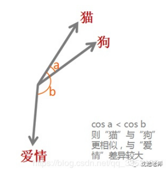
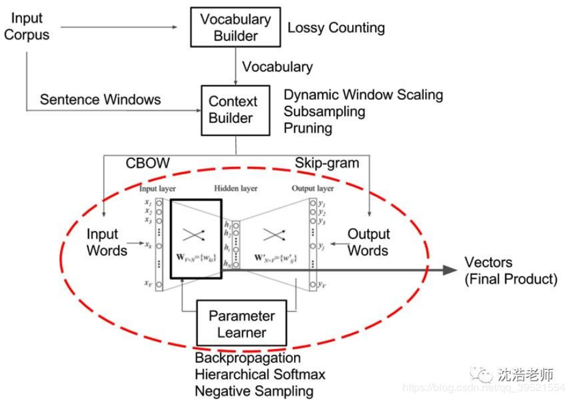
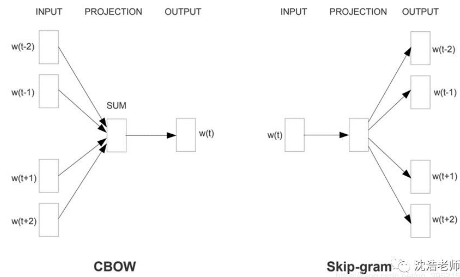
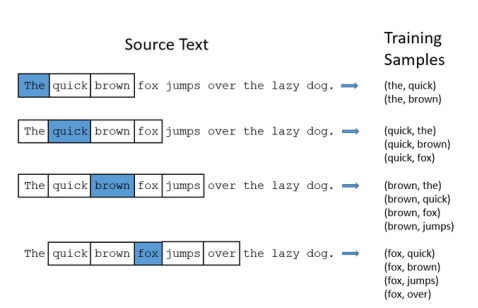
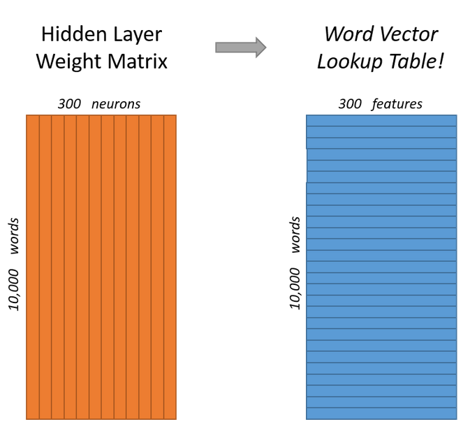
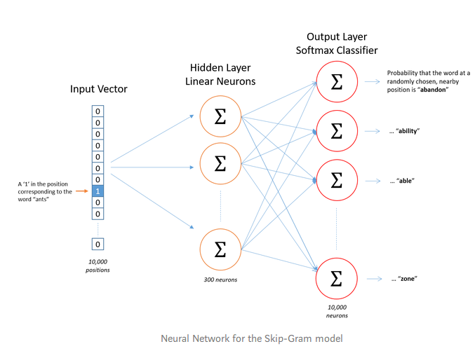
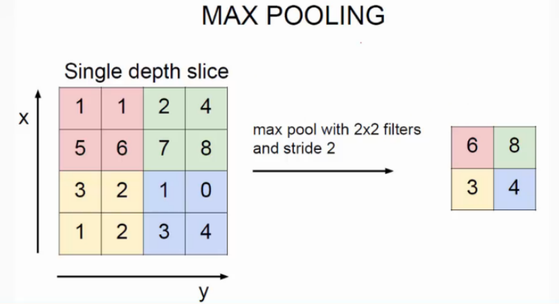

---

---

# 重要概念

## word embedding

### 定义

词嵌入是自然语言处理的重要突破之一。

词嵌入（word embedding）是一种词的类型表示，具有相似意义的词具有相似的表示，是将词汇映射到实数向量的方法总称。

### 示例

通过词嵌入这种方式将单词转变为词向量，机器便可对单词进行计算，通过计算不同词向量之间夹角余弦值cosine而得出单词之间的相似性。

把每个单词都变成一个向量，目的还是为了方便计算。

### 主要算法

目前主要有三种算法：

1、 **Embedding Layer** ==

Embedding  Layer是与特定自然语言处理上的神经网络模型联合学习的单词嵌入。该嵌入方法将清理好的文本中的单词进行one  hot编码（热编码），向量空间的大小或维度被指定为模型的一部分，例如50、100或300维。向量以小的随机数进行初始化。Embedding  Layer用于神经网络的前端，并采用反向传播算法进行监督。

被编码过的词映射成词向量，如果使用多层感知器模型MLP，则在将词向量输入到模型之前被级联。如果使用循环神经网络RNN，则可以将每个单词作为序列中的一个输入。

这种学习嵌入层的方法需要大量的培训数据，可能很慢，但是可以学习训练出既针对特定文本数据又针对NLP的嵌入模型。

2、**Word2Vec（Word to Vector）**

​	Word2Vec是一种用于有效学习从文本语料库嵌入的独立词语的统计方法。

​	其核心思想就是基于上下文，先用向量代表各个词，然后通过一个预测目标函数学习这些向量的参数。

​	Word2Vec的网络主体是一种单隐层前馈神经网络，输入和输出均为词向量，其主要训练的是图中的红圈部分。

CBOW&Skip-Gram

CBOW将一个词所在的上下文中的词作为输入，而那个词本身作为输出,即x-input:context---->y-label:target,通过在一个大的语料库训练，得到一个从输入层到隐含层的权重模型。

用途：看到一个上下文，大概能猜出target这个词和它的意思。

Skip-gram是将一个词所在的上下文中的词作为输出，而那个词本身作为输入。

x-input:target---->y-label:context。

用途：给出一个词，希望预测可能出现的上下文的词，2-gram比较常用。

word2vec里预测词向量时，预测出来的词是含有词义的，比如上文提到的词向量’powerful’会相对于’Paris’离’strong‘距离更近。

3、**Doc2vec**

 	Doc2vec又叫Paragraph Vector是Tomas Mikolov基于word2vec模型提出的，该算法用于预测一个向量来表示不同的文档。

​	Doc2vec是一个无监督学习算法，该模型的结构潜在的克服了词袋模型的缺点。其具有一些优点，比如不用固定句子长度，接受不同长度的句子做训练样本。

PV-DM（Distributed Memory Model of paragraph vectors）类似于word2vec中的CBOW模型

# 用途

Word2vec

欧几里德相似性对于高维词向量不能很好地起作用。 这是因为即使单词嵌入代表不同的含义，欧几里德相似性也会随着维数的增加而增加。 
或者，我们可以使用余弦相似性来测量两个向量之间的相似性。 在数学上，它测量在多维空间中投影的两个矢量之间的角度的余弦。 
余弦相似性捕获单词矢量的角度而不是幅度。 在余弦相似性下，没有相似性表示为90度角，而1的总相似度是0度角

# 原理

神经网络输入：

使用热编码(one-hot)构建一个由单词组成的词汇表，the, quick, brown, fox, jump, over, the lazy, dog, brown由这个向量表示:[0,0,1,0,0,0,0,0,0,0,0]。

https://becominghuman.ai/how-does-word2vecs-skip-gram-work-f92e0525def4

https://kavita-ganesan.com/gensim-word2vec-tutorial-starter-code/#.XW-nP_xS_mg

https://www.kaggle.com/pierremegret/gensim-word2vec-tutorial

Skip-Gram模型背后的主要思想是：它将大型语料库中的每个单词（我们将其称为焦点单词），并在定义的“窗口”中逐个采用围绕它的单词。 提供一个神经网络，训练后将预测每个单词实际出现在焦点词周围的窗口中的概率。

# 卷积神经网络

卷积层  池化层

池化层：对输入的特征图进行压缩，一方面使特征图变小，简化网络计算复杂度；一方面进行特征压缩，提取主要特征。

