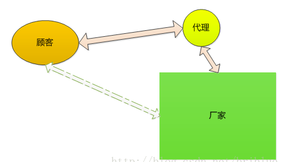
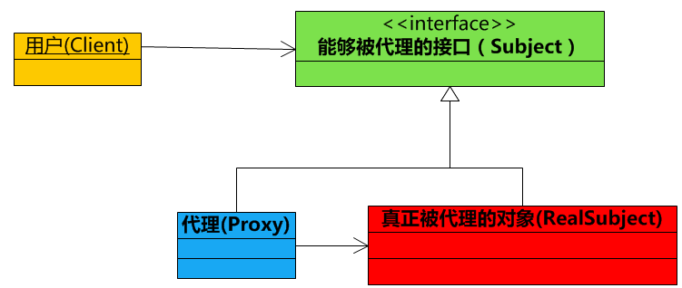
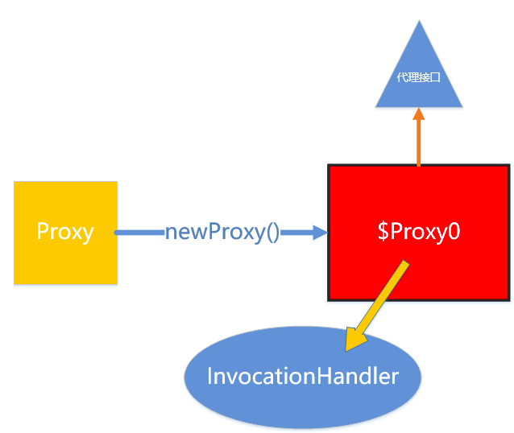

# 代理模式

## 应用场景



顾客可以直接从厂家购买产品，但是现实生活中，很少有这样的销售模式。一般都是厂家委托给代理商进行销售，顾客跟代理商打交道，而不直接与产品实际生产者进行关联。

代理就有一种中间人的味道。

## 结构



## 要素

- 用户只关心接口功能，而不在乎谁提供了功能。上图中接口是 Subject。
- 接口真正实现者是上图的 RealSubject，但是它不与用户直接接触，而是通过代理。
- 代理就是上图中的 Proxy，由于它实现了 Subject 接口，所以它能够直接与用户接触。
- 用户调用 Proxy 的时候，Proxy 内部调用了 RealSubject。
- Proxy 是中介者，它可以增强 RealSubject 操作。


## 模式

### 静态代理

**代理模式可以在不修改被代理对象的基础上，通过扩展代理类，进行一些功能的附加与增强。**

**值得注意的是，代理类和被代理类应该共同实现一个接口，或者是共同继承某个类。**

```
#接口
package com.frank.test;

public interface Movie {
	void play();
}


#RealSubject,真正的实现这个 Movie 接口的类
package com.frank.test;

public class RealMovie implements Movie {

	@Override
	public void play() {
		// TODO Auto-generated method stub
		System.out.println("您正在观看电影 《肖申克的救赎》");
	}

}

#代理，影院可以在播放电影的时候，产生一些自己的经济收益，比如卖爆米花、可乐等，然后在影片开始结束时播放一些广告。
package com.frank.test;

public class Cinema implements Movie {
	
	RealMovie movie;
	
	public Cinema(RealMovie movie) {
		super();
		this.movie = movie;
	}


	@Override
	public void play() {
		
		guanggao(true);
		
		movie.play();
		
		guanggao(false);
	}
	
	public void guanggao(boolean isStart){
		if ( isStart ) {
			System.out.println("电影马上开始了，爆米花、可乐、口香糖9.8折，快来买啊！");
		} else {
			System.out.println("电影马上结束了，爆米花、可乐、口香糖9.8折，买回家吃吧！");
		}
	}

}

#测试
package com.frank.test;

public class ProxyTest {

	public static void main(String[] args) {
		
		RealMovie realmovie = new RealMovie();
		
		Movie movie = new Cinema(realmovie);
		
		movie.play();

	}

}
```


### 动态代理

静态：Cinema 类是代理，需要手动编写代码让 Cinema 实现 Movie 接口。

动态：让程序在运行的时候自动在内存中创建一个实现 Movie 接口的代理，而不需要去定义 Cinema 这个类。

#### 结构



红框中 `$Proxy0`就是通过 Proxy 动态生成的。
`$Proxy0`实现了要代理的接口。
`$Proxy0`通过调用 `InvocationHandler`来执行任务。


#### 实现

==Proxy==

过 Proxy 的静态方法 newProxyInstance 才会动态创建代理

```
public static Object newProxyInstance(ClassLoader loader,
                                          Class<?>[] interfaces,
                                          InvocationHandler h)
```

 3 个参数意义:

- loader 自然是类加载器
- interfaces 代码要用来代理的接口
- h 一个 InvocationHandler 对象


==InvocationHandler==

InvocationHandler 是一个接口，每个代理的实例都有一个与之关联的 InvocationHandler 实现类，如果代理的方法被调用，那么代理便会通知和转发给内部的 InvocationHandler 实现类，由它决定处理。

```
public interface InvocationHandler {

    public Object invoke(Object proxy, Method method, Object[] args)
        throws Throwable;
}
```

InvocationHandler 内部只是一个 invoke() 方法，正是这个方法决定了怎么样处理代理传递过来的方法调用。

    proxy 代理对象
    method 代理对象调用的方法
    args 调用的方法中的参数

Proxy 动态产生的代理会调用 InvocationHandler 实现类，所以 InvocationHandler 是实际执行者


# 参考

代理：https://blog.csdn.net/briblue/article/details/73928350