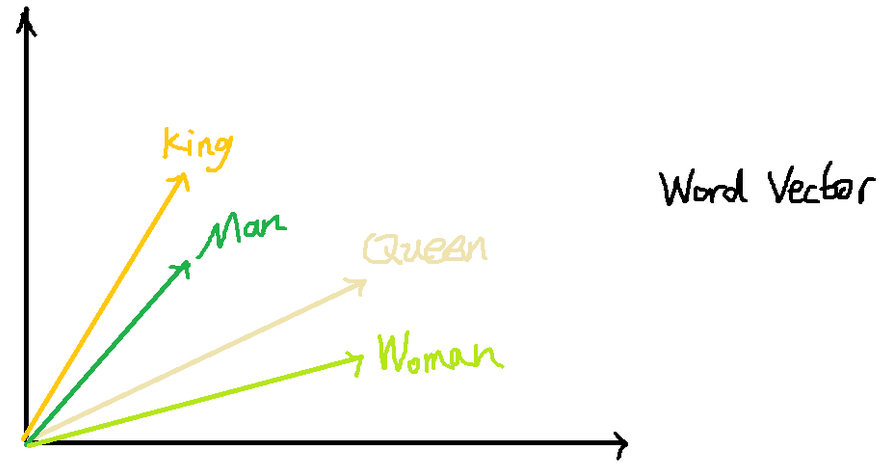
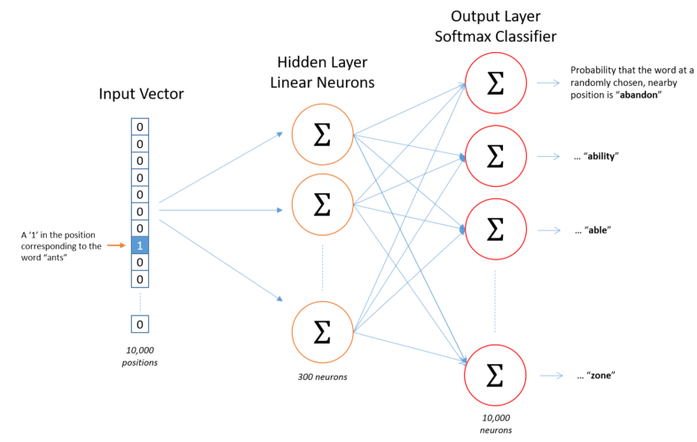
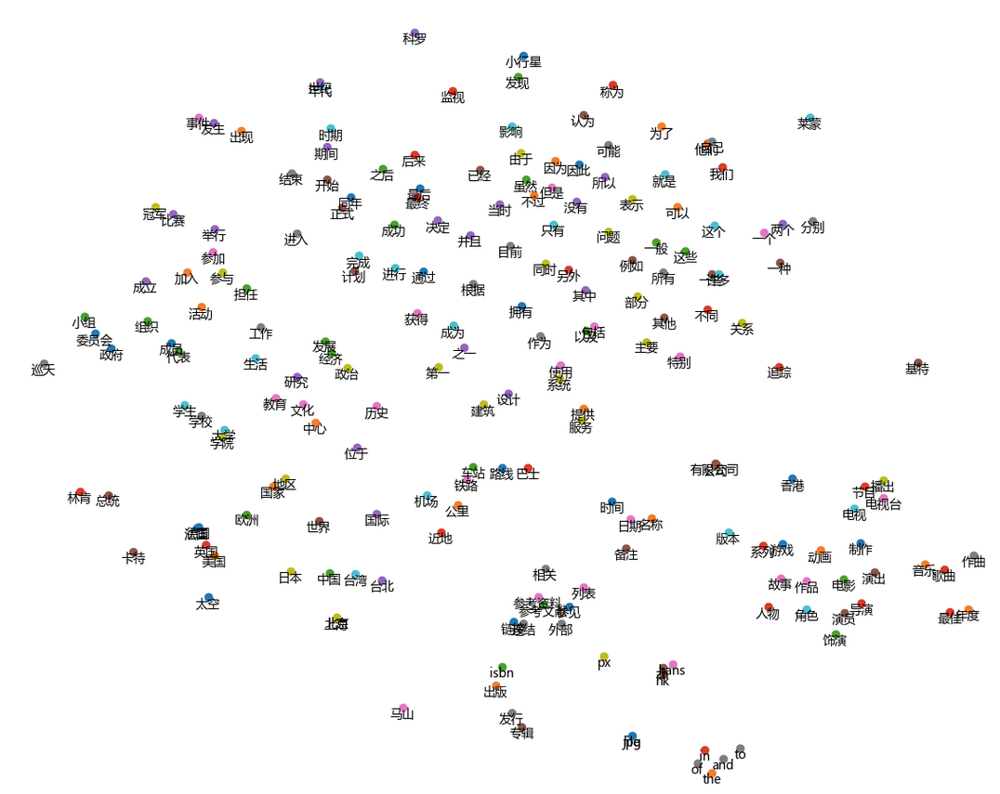

# 基本概念

## 词向量

在NLP里，最细的粒度是词语，由词语再组成句子，段落，文章。

如何表示词语？

1、向量：one-hot编码对词组进行编码。

向量长度是一定的，向量长度是对应的整个词汇表的大小。

One-hot code非常简单，但是存在很大的问题，当词汇表很大，会造成维度灾难。

比如数百万个词组成了词汇表时，每个词的向量都是数百万维，并且one-hot 编码的向量会过于稀疏，这样的稀疏向量表达一个词效率并不高。

2、词向量：dristributed representation。

通过训练将每个词都映射到一个较短的词向量上。

所有的词向量构成了词汇表的每个词。

词向量能表示不同词组间组合的关系。

解决了每个词向量的维度过大问题。

词向量用途？

词向量是对词语的一种表示。

有了词向量就可以将句子表示为一个向量序列，即二维张量。

多个长度相同的句子表示为一个三维张量。

词向量是一个二维矩阵，维度为`V*d`，`V`是词的总个数，`d`是词向量的维度。

- 词向量如何训练？

创建词向量是指获取大量文本的过程，并为每个单词创建一个向量，这样在语料库中共享公共上下文的词就位于向量空间中彼此相邻的位置。

CBOW模型和Skip-gram模型**

CBOW模型尝试预测给定上下文词的中心词，而skip-gram模型试图预测给定中心词的上下文词。

输入层：

上图中，词汇表大小为10000，输入是one-hot编码，如单词"ants"位置为1

输出层：

网络输出向量大小为10000，对于词汇表中的每个词来说，随机选择临近单词ants的概率是字汇词。每个输出神经元(我们的词汇表中的每个单词都有一个)将产生0到1之间的输出，所有这些输出值的和将加起来等于1。

隐藏层：

模型训练后，隐藏层将会有训练过的词向量。隐藏层大小对应于词向量空间长度。

上图中，Skip-gram神经网络包含了大量的权重，隐层的权重矩阵应该为10000行，300列（隐层有300个结点）。

问题？

如何训练并更新权重，两个权重矩阵参数有10000*300=3000000，使用梯度下降法耗费巨大。

改进：

1、对频繁单词进行二次采样，以减少训练示例的数量。

2、用一种被称为“负采样”的技术修改优化目标，这种技术使得每个训练样本只更新模型权重的一小部分。

对频繁词进行子抽样和负抽样，不仅减少了训练过程的计算负担，而且提高了生成的词向量的质量。

Word2Vec实现了一个“二次采样”方案来解决这个问题。对于我们在培训文本中遇到的每个单词，我们都有可能将其从文本中有效删除。我们切掉单词的概率与单词的频率有关。

http://mccormickml.com/2017/01/11/word2vec-tutorial-part-2-negative-sampling/

###训练与可视化词向量

http://www.atyun.com/14019.html

https://blog.csdn.net/zhl493722771/article/details/82781675

# MITIE

一个专注于信息提取的开源自然语言处理库,该库是使用最先进的统计机器学习工具构建的。

MITIE 即 MIT 的 NLP 团队发布的一款免费且先进的信息抽取工具。